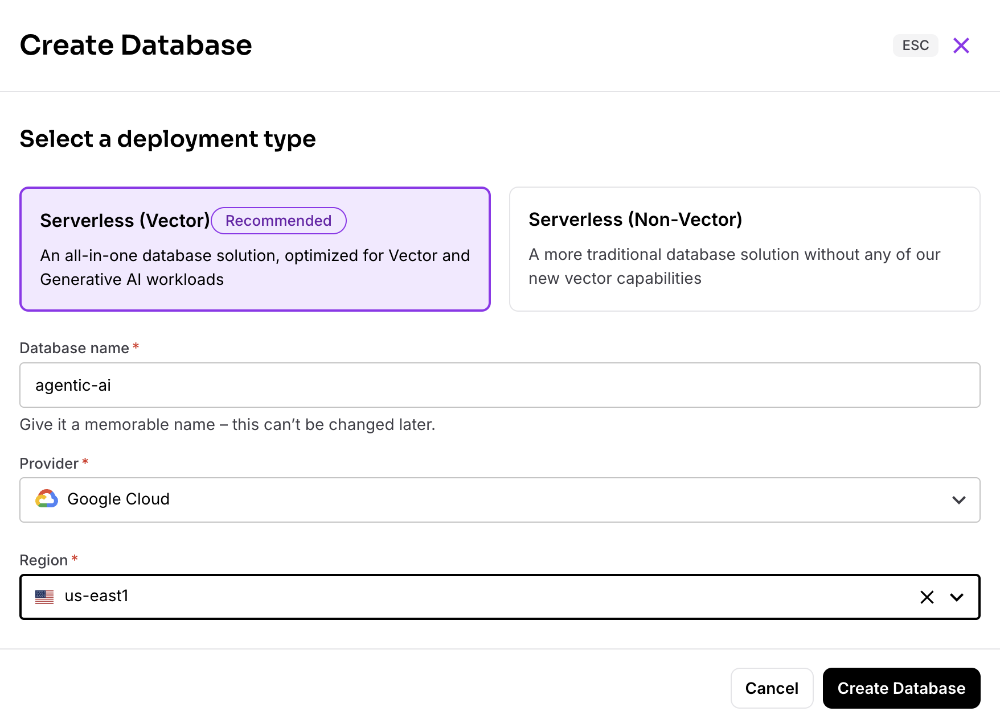
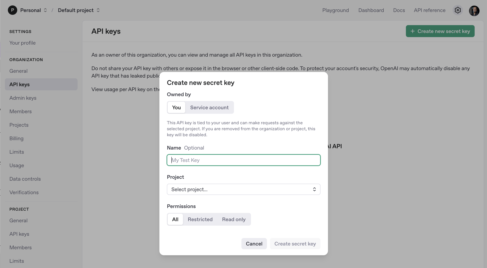

# 🧠 Agentic AI Workshop – Langflow + Astra DB

## 🎯 Goal of the workshop
Learn how to build a simple AI agent with Langflow, enhance it with Retrieval-Augmented Generation (RAG) using Astra DB, and then expand it with tools for powerful agentic AI functionality.

## 🛠️ Prerequisites
This workshop assumes you have access to:
1. [A Github account](https://github.com)

During the course, you'll gain access to the following by signing up for free:
1. [DataStax Astra DB](https://astra.datastax.com) (you can sign up through your **public** Github account)
2. [OpenAI account](https://platform.openai.com/signup) (you can sign up through your Github account)
    - *Alternatively we'll provide some OpenAI API keys to use for this workshop*

Follow the below steps and note down the **Astra DB API Endpoint**, **Astra DB ApplicationToken** and **OpenAI API Key** as we'll need them later on.

### Sign up for Astra DB
Make sure you have a vector-capable Astra database (get one for free at [astra.datastax.com](https://astra.datastax.com))
- Sign up or log in
- Click `Databases` and click `Create Database` 
- Select `Serverless (Vector)`, type a database name, i.e. `agentic-ai` and select a Cloud Provider and Region of choice
- Wait a few minutes for it to provision
- Note down the **API Endpoint** which can be found in the right pane underneath *Database details*.
- Click on `Generate Token` and give it a name, i.e. `agentic-ai-token` and click `Generate`. Now click on the copy button and paste the **Application Token** somewhere for later use



### Sign up for OpenAI
- Create an [OpenAI account](https://platform.openai.com/signup) or [sign in](https://platform.openai.com/login).
- Navigate to the [API key page](https://platform.openai.com/account/api-keys) and create a new **Secret Key**, optionally naming the key.
    - *Alternatively we'll provide some OpenAI API keys to use for this workshop*



## ⚡️ Open this tutorial on Github Codespaces
To make life easier, we'll use the awesome Github Codespace functionality. Github offers you a completely integrated developer experience and resources to get started quickly. How?

1. Open the [agentic-ai-workshop](https://github.com/michelderu/agentic-ai-workshop) repository
2. Click on `Use this template`->`Ceate new repository` as follows:

    

3. Now select your github account and name the new repository. Ideally also set the description. Click `Create repository`

    

4. Cool! You just created a copy in your own Gihub account! Now let's get started with coding. Click `Create codespace on main` as follows:

    

Now you're ready to rock and roll! 🥳

5. Configure the secrets as follows:

- Copy `.env.example` to `.env`
- Edit `.env` and provide the required variables `OPENAI_API_KEY`, `ASTRA_DB_API_ENDPOINT` and `ASTRA_DB_APPLICATION_TOKEN`

6. Now we can run Langflow as follows in the terminal window:

```bash
pip install uv
uv sync
uv run langflow run --env-file .env
```

This starts Langflow and opens a port to your Codespace in the cloud. In case you loose track of the URL to Langflow, just click on `PORTS` in the terminal window.

🎉 Congrats! You finished the set-up part of the workshop. Now for the fun part!

## 🎯 Doel van de workshop
Leer hoe je een eenvoudige AI-agent bouwt met Langflow, deze verrijkt met Retrieval-Augmented Generation (RAG) via Astra DB, en vervolgens uitbreidt met tools voor krachtige agentic AI-functionaliteit.

---

## 🛠️ Benodigdheden (vooraf installeren)
```bash
pip install langflow openai astrapy python-dotenv
```

Zorg ook voor:
- Een OpenAI API key
- Een Astra DB account en project met aangemaakte vector-collectie

---

## 📦 Workshop Stappenplan

### 1. 🔹 Introductie: Wat is een Agent?
Een agent is een AI die input ontvangt, context begrijpt en acties onderneemt via tools of geheugen. We bouwen vandaag een simpele agent en breiden die uit met geheugen, kennis, en tools.

---

### 2. 🧱 Setup van een Eenvoudige Langflow Agent
**Doel:** Maak een flow met input → model → output

#### Stappen:
1. Open Langflow of gebruik Python-code:
```python
from langflow import LangflowGraph
from langflow.base.components import ChatInput, ChatOutput, OpenAIModel

graph = LangflowGraph(name="SimpleAgent")

input_node = ChatInput(name="UserInput")
model_node = OpenAIModel(name="OpenAIModel", model_name="gpt-4")
output_node = ChatOutput(name="AgentOutput")

graph.connect(input_node, model_node)
graph.connect(model_node, output_node)
```
2. Test een simpele prompt zoals:
> "Wat is het verschil tussen AI en machine learning?"

---

### 3. 📚 Retrieval-Augmented Generation (RAG) met Astra DB
**Doel:** Voeg externe kennis toe aan je agent

#### Voorbereiding:
- Upload een dataset naar je Astra DB (bijv. een aantal documenten over het onderwerp 'duurzaamheid')
- Verzamel je `ASTRA_DB_TOKEN`, `API_ENDPOINT`, `KEYSPACE`, en `COLLECTION_NAME`

#### Stappen:
```python
from langflow.components.vectorstores import AstraDBVectorStore
from langflow.components.retrievers import VectorStoreRetriever
from langflow.components.memory import ContextualMemory

astra_vectorstore = AstraDBVectorStore(
    name="AstraStore",
    token="<ASTRA_DB_TOKEN>",
    api_endpoint="<ASTRA_DB_API_ENDPOINT>",
    keyspace="<ASTRA_DB_KEYSPACE>",
    collection_name="knowledge"
)

retriever = VectorStoreRetriever(name="AstraRetriever")
memory = ContextualMemory(name="ContextualMemory")

graph.connect(astra_vectorstore, retriever)
graph.connect(retriever, memory)
graph.connect(input_node, memory)
graph.connect(memory, model_node)
```

#### Voorbeeldvraag:
> "Wat zijn de belangrijkste principes van circulaire economie?"

---

### 4. 🧠 Agentic Gedrag toevoegen met Tools
**Doel:** Laat de agent zelfstandig taken uitvoeren met tools zoals web search of rekenen

#### Stappen:
```python
from langflow.components.tools import ToolNode

search_tool = ToolNode(name="SearchTool", tool_type="web_search")
calculator_tool = ToolNode(name="Calculator", tool_type="math")

graph.connect(input_node, search_tool)
graph.connect(search_tool, model_node)
graph.connect(input_node, calculator_tool)
graph.connect(calculator_tool, model_node)
```

#### Voorbeeldvragen:
> "Zoek het laatste nieuws over CO2-compensatie"
> 
> "Wat is 1,5 keer de CO2-uitstoot van Nederland in 2023?"

---

## 🌍 Case: Duurzame Toekomstscenario's (voor Agentic AI)
**Context:** Stel je hebt een AI-agent die overheidsdocumenten, klimaatakkoorden en economische rapporten heeft geïndexeerd in Astra DB. Je wilt hem vragen laten beantwoorden en plannen laten opstellen op basis van real-world kennis.

#### Voorbeelden:
- "Stel een stappenplan op voor een stad om in 2035 CO2-neutraal te zijn."
- "Welke subsidies zijn beschikbaar in Nederland voor circulair bouwen?"
- "Maak een inschatting van de economische impact van een 10% reductie in stikstof."

---

## ✅ Afronden & Reflectie
- Wat heb je gebouwd?
- Hoe zie je de rol van agentic AI in jouw werkveld?
- Wat zijn ethische overwegingen bij het inzetten van zelfredzame AI-systemen?

---

## 🧩 Bonus: Vervolg
- Integreer je eigen API’s als tools
- Voeg planningsmodules toe (langchain agents, task decomposition)
- Gebruik voice- of multimodale input

Veel succes en plezier met het bouwen van je eigen Agentic AI! 🚀
