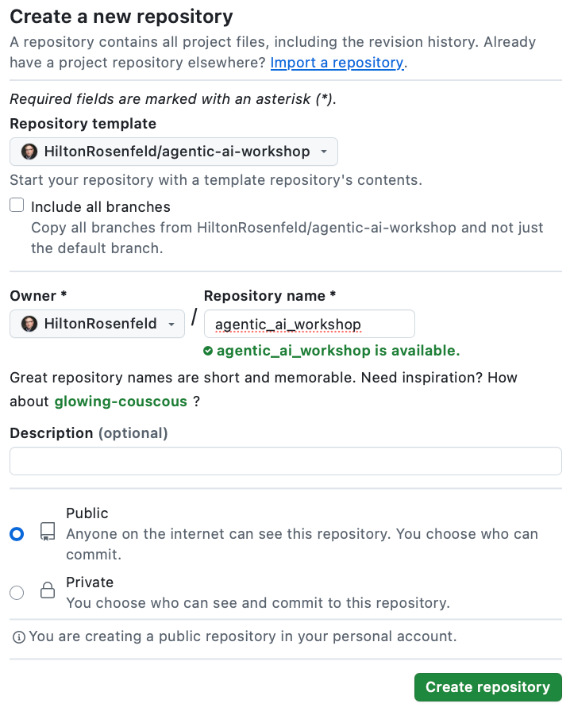
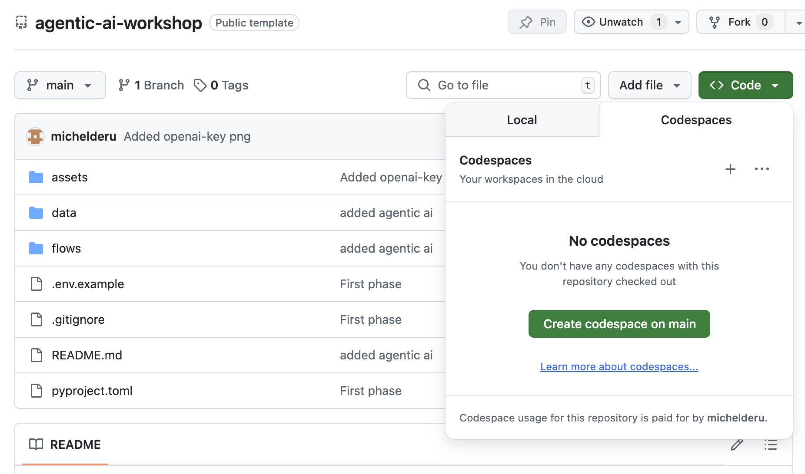
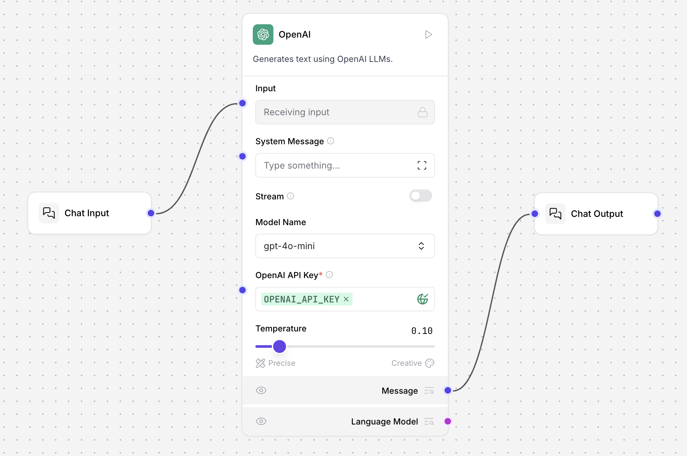
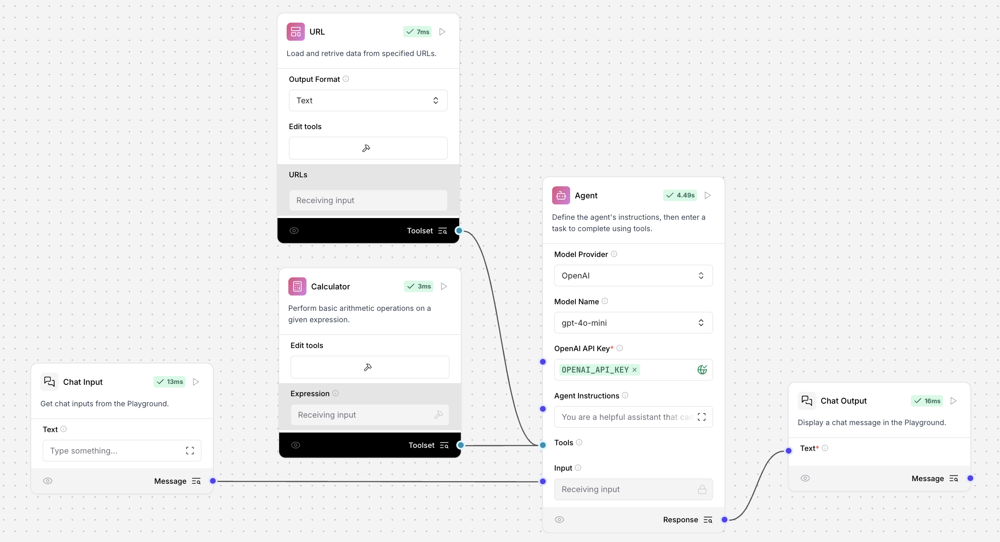

# 🧠 Agentic AI Workshop – Langflow + Astra DB

## 🎯 Goal of the workshop
Learn how to build a simple AI agent with Langflow, enhance it with Retrieval-Augmented Generation (RAG) using Astra DB, and then expand it with tools for powerful agentic AI functionality.

## 🛠️ Prerequisites
This workshop assumes you have access to:
1. [A Github account](https://github.com)

During the course, you'll gain access to the following by signing up for free:
1. [DataStax Astra DB](https://astra.datastax.com) (you can sign up through your **public** Github account)
2. [OpenAI account](https://platform.openai.com/signup) (you can sign up through your Github account)
    - *Alternatively we'll provide some OpenAI API keys to use for this workshop*

Follow the below steps and note down the **Astra DB API Endpoint**, **Astra DB ApplicationToken** and **OpenAI API Key** as we'll need them later on.

### Sign up for Astra DB
Make sure you have a vector-capable Astra database (get one for free at [astra.datastax.com](https://astra.datastax.com))
- Sign up or log in
- Click `Databases` and click `Create Database` 
- Select `Serverless (Vector)`, type a database name, i.e. `agentic-ai` and select a Cloud Provider and Region of choice
- Wait a few minutes for it to provision
- Note down the **API Endpoint** which can be found in the right pane underneath *Database details*.
- Click on `Generate Token` and give it a name, i.e. `agentic-ai-token` and click `Generate`. Now click on the copy button and paste the **Application Token** somewhere for later use

    

### Sign up for OpenAI
- Create an [OpenAI account](https://platform.openai.com/signup) or [sign in](https://platform.openai.com/login).
- Navigate to the [API key page](https://platform.openai.com/account/api-keys) and create a new **Secret Key**, optionally naming the key.
    - *Alternatively we'll provide some OpenAI API keys to use for this workshop*

    

## ⚡️ Open this tutorial on Github Codespaces
To make life easier, we'll use the awesome Github Codespace functionality. Github offers you a completely integrated developer experience and resources to get started quickly. How?

1. Open the [agentic-ai-workshop](https://github.com/michelderu/agentic-ai-workshop) repository
2. Click on `Use this template`->`Ceate new repository` as follows:

    

3. Now select your github account and name the new repository. Ideally also set the description. Click `Create repository`

    

4. Cool! You just created a copy in your own Gihub account! Now let's get started with coding. Click `Create codespace on main` as follows:

    

5. Configure the secrets as follows:

- Copy `.env.example` to `.env`
- Edit `.env` and provide the required variables `OPENAI_API_KEY`, `ASTRA_DB_API_ENDPOINT` and `ASTRA_DB_APPLICATION_TOKEN`

6. Now we can run Langflow as follows in the terminal window:

    ```bash
    pip install uv
    uv sync
    uv run langflow run --env-file .env
    ```

    This starts Langflow and opens a port to your Codespace in the cloud. In case you loose track of the URL to Langflow, just click on `PORTS` in the terminal window.

🎉 Congrats! You finished the set-up part of the workshop. Now for the fun part!

## 📦 Workshop follow-along

### 1. 🧱 Setup of a simple Langflow Chatbot
**Goal:** Create a chatbot with: input → model → output

#### Steps:
1. Open Langflow
2. Click `+ New Flow` / `+ Blank Flow`
3. Collapse `Inputs` and drag the `Chat Input` component to the canvas
4. Collapse `Models` and drag the `OpenAI` component to the canvas. Connect `Input` to the `Chat Input`
5. Collapse `Outputs` and drag the `Chat Output` component to the canvas. Connect `Message` to the `Chat Output` component



👏 Amazing! You just built your first flow. Let's run it by clicking `▶️ Playground` and asking the question:

    What's the difference between AI and Machine Learning?

You'll see the Large Language Model (LLM) answer your question nicely!

### 2. 🧭 Familiarize yourself with Langflow
**Goal:** Understand the main components of Langflow

#### Steps:
1. If still open, close the Playground popup
2. Select `Chat Input` and click `Controls`
3. You'll see a field name `Text`, type `What's the difference between AI and Machine Learning` in the text field. close the popup
4. Select `Chat Output`, the three dots `...` and click `Expand`
5. Do the same with `Chat Input`
6. Click the play button `▶️` on the `Chat Output` component and see the flow run

Notice the running time of the separate components.  
Click the magnifying glass `🔍` in the `OpenAI` component. This shows you a popup with the intermediate data that is passed to the next component. Very useful for debugging purposes!


### 3. 🧠 Agentic AI with Langflow
**Goal:** Create an AI Agent that has access to a URL tool and a Calculator tool



#### Steps:
1. Reproduce the above flow (or load it from `./flows/basic-agentic-ai.json`)
2. Esure the `OPENAI_API_KEY` has been set
3. When adding the `URL` and `Calculator` components to the canvas, select them and click `Tool mode`

👏 Amazing! You just built your first AI Agent. Let's run it by clicking `▶️ Playground` and asking the question:

    What is 2x the value of a Euro in Dollars

You'll get an answer stating a value of $2.16 or something (as of April 2025).

To see the magic behind, simply click the down arrow `🔽`. The Agent decided to use two tools:
1. The URL tool to fetch the current exchange rates
2. The Calculator tool to multiply the value by two


### 4. 📚 Retrieval-Augmented Generation (RAG) with Astra DB
**Goal:** Adding external knowledge by making use of Vector Search

#### Preparation:
Load a data set in your `agentic-ai` database in [Astra DB](https://astra.datastax.com) by creating an additional flow. Either by creating a new flow or adding components to your existing flow.
1. Collapse `Data` and drag the `URL` component to the canvas

